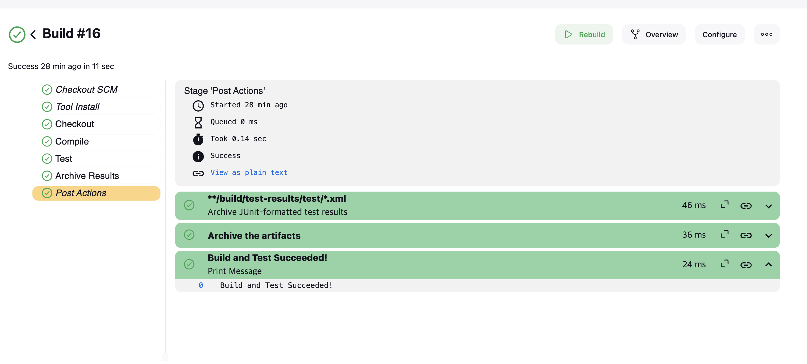

# 단위테스트 - XP 미션 제출 B831051 김승완, B911397 김동혁

## 역할
1. 김승완 : Book 클래스를 작성하고, BookManager 클래스를 작성함. 전자는 책의 id, 제목, 저자, 출판년도를 속성으로 가짐. 후자 클래스는 CurrentHashMap 자료구조에 저장함. 
BookManager는 책을 저장하는 `addBook()`, `searchBook()`, `deleteBook()` 메서드를 가지며, 내부적으로 존재하지 않는 책을 조회하거나 삭제하려는 경우 오류를 반환하고, 이미 존재하는 책을 추가하려는 경우에도 오류를 반환함
2. 김동혁 : BookManager 클래스를 활용하여 여러 책을 저장하고, 조회하고, 삭제하는 테스트 코드를 작성함 -> BookManagerTest 클래스

 

# Mission 2 형상 관리와 자동 빌드 & binary search 구현 및 성능 테스트 in Jenkins

## 역할
1. 김동혁 : 기존의 BookManager 클래스 내에서의 bookId를 이용한 이진 탐색 메서드를 구현. 이때 bookId로 책을 logN의 로직으로 조회하지만 존재하지 않는 경우 에러를 **throw**
2. 김승완 : 김동혁 팀원의 binary search 메서드를 바탕으로한 테스트 코드 작성 : 해당 테스트 코드는 test 디렉터리의 `BookBinarySearchTest.java` 파일에서 진행 

### binary Search 코드
1. 책을 항상 정렬하여 보관할 sortedBooks라는 ArrayList를 static 하게 생성
2. 특정 bookId를 이용하여 이진탐색을 진행

### binary Search test 코드
1. 특정 id를 가진 책 조회, 존재하지 않는 id를 가진 책 조회, 모든 책들의 조회 시간 평균 케이스 3가지로 나눠서 각 경우의 성능 `timestamp`를 기록함.

## Continuous Integration & Continuous Delivery, Deployment -> 공동 진행(김승완, 김동혁)
1. localhost를 listening할 수 있는 ngrok 서비스를 이용, `ngrok http {포트번호}` 명령어를 통해 얻어낸 ngrok 도메인을 팀 github repository webhook에 연결.  
> 이는 레토지토리로 code push가 일어날 때마다 ngrok, jenkins 서버로 post 요청을 보내 빌드 및 테스트를 트리거함
2. 레포지터리의 루트 path에 Jenkins 파일을 위치시켜 push될 때마다 해당 스크립트 파일에 따른 빌드 & 테스트 & 관련 결과 archiving 작업의 진행
3. gradle 빌드 툴은 test 디렉터리에 위치한 BookManagerTest, BookBinarySearchTest 의 테스트를 각각 실행함. 전자는 해당 class 객체가 생성, 삽입, 조회, 삭제의 기능을 검사하며 후자는 정렬된 책 리스트를 이진 탐색을 진행. 후자는 각 테스트 케이스마다 timestamp를 기록하여 **xml**, **txt** 방식으로 `Jenkins workspace`에 archiving.

## Trouble Shooting
1. jenkins 파일의 빌드 과정을 일일히 적기 어려움 : `Gradle` 빌드 툴로 대체, 이는 jenkins의 gradle 설치 플러그인으로 해결
2. 테스트 결과를 확인할 수 있어야 함 : 빌드 결과물을 수집하고 실행하는 `post`를 통해 설정함. 기본적으로 gradle은 테스트를 진행하면 build 디렉터리의 test-results/test 하위 디렉터리에 xml 양식으로 테스트 결과물을 만들어냄
3. github webhooks가 제대로 연동되지 않음 : post 요청의 양식(application/json), 302 에러(마지막 엔드포인트에 `/` 를 포함하지 않은 문제).
4. git pull 시에 팀원 PR로 인한 merge 사항을 먼저 로컬 레포지토리에 반영하고, 새로운 commit을 반영하는 충돌 사항을 해결

## 결과 이미지

 
> 해당 workspace에 결과 관련 xml과 txt 파일일 Jenkins pipeline에 의해 위치한 것을 볼 수 있다.

> `BookManager` 클래스의 기본 동작에 대한 테스트 케이스, book 이진 탐색에 대한 테스트 결과를 xml 파일로 출력한 것을 볼 수 있다.

> 두 테스트 결과가 txt 파일에 잘 들어간 것을 볼 수 있다.

> 빌드도 성공적으로 진행된 것을 볼 수 있다.

> 팀원 간 깃 협업 로그

### 제출자
1. B831051 김승완
2. B911397 김동혁

### github Repository 주소
[team gitub 협업 repository 주소](https://github.com/Programming-Seungwan/hongik-swe)